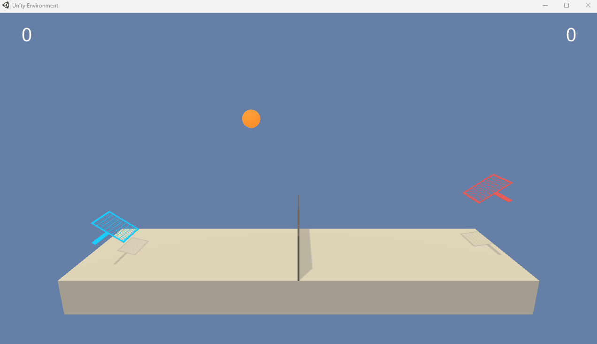
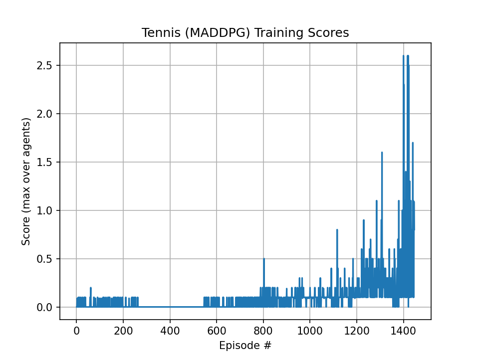

# Collaboration and Competition (Tennis) using MADDPG

This repository contains my solution for Udacity’s Deep Reinforcement Learning Nanodegree **Project 3: Collaboration and Competition**.

I used a **basic MADDPG-style approach** (two DDPG agents learning together with a shared replay buffer). Because this is a multi-agent environment, training can be **unstable** and the score may go up/down during learning.

## Demo

  

---

## Environment

Two agents control rackets and try to keep the ball in play:

- **Agents:** 2
- **Reward:**
  - +0.1 if an agent hits the ball over the net
  - -0.01 if an agent lets the ball hit the ground or hits it out of bounds
- **Observation space:** 8 continuous values per agent (environment stacks 3 frames → **24** values seen by the agent)
- **Action space:** 2 continuous actions per agent, each in **[-1, 1]**
  - move toward / away from the net
  - jump

### Solved criterion
After each episode:
1. Sum rewards for each agent → gives **2 scores**.
2. Take the **maximum** of the two scores → this is the **episode score**.
3. Compute the **average of episode scores over the last 100 episodes**.

The environment is **solved** when:
- **Average(100) >= +0.5**

---

## Approach — MADDPG (two DDPG agents)

I trained **two deterministic actor–critic agents** together:

- Each agent has its own **Actor** (policy) and **Critic** (value) networks
- Actions are explored using **Ornstein–Uhlenbeck noise**
- Experiences from both agents are stored into a **shared replay buffer**
- Target networks are used with **soft updates** for stability

This is a simple/self-play style setup: both agents learn at the same time.

---

## Files

- `src/model.py` — Actor/Critic networks
- `src/maddpg_agent.py` — MADDPG agent + replay buffer + noise
- `src/train.py` — training script (saves weights + plot)
- `src/eval.py` — evaluate saved actors
- `checkpoint_actor_0.pth`, `checkpoint_actor_1.pth` — trained actor weights
- `checkpoint_critic_0.pth`, `checkpoint_critic_1.pth` — trained critic weights
- `scores.png` — training curve (episode score + Average(100))
- `Report.md` — project report

---

## Setup

2) Download the Unity Tennis environment
Download the correct Tennis environment for your OS from Udacity and unzip it into the repository root, for example:

Download and unzip the environment into the **repository root**.

- **Windows (64-bit):** [click here](https://s3-us-west-1.amazonaws.com/udacity-drlnd/P3/Tennis/Tennis_Windows_x86_64.zip)
- **Linux:** [click here](https://s3-us-west-1.amazonaws.com/udacity-drlnd/P3/Tennis/Tennis_Linux.zip)
- **Mac:** [click here](https://s3-us-west-1.amazonaws.com/udacity-drlnd/P3/Tennis/Tennis.app.zip)

---

## Training

`python src/train.py --env ./Tennis_Windows_x86_64/Tennis.exe --worker_id 1`

From the repository root:

## Results

- Solved in **1446 episodes**

